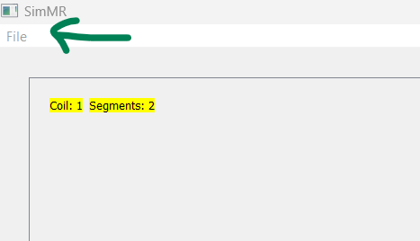

# SIMMR: SIMulating MR coil sensitivities

Welcome to SIMMR! This is a Python GUI that allows you to design magentic resonance (MR) coil arrays and calculate their sensitivity profiles. Sensitivity profiles are determined using the principle of reciprocity and Biot-Savart law. The sensitivity is calculated as
$$S = \textbf{B}_x - i\textbf{B}_y$$
where $\textbf{B}_x$ and $\textbf{B}_y$ represent the transverse components of the magnetic field generated by the coil. In our calculation, we take all physical constants to be one and the current to be 1 A producing sensitivities that are essentially normalized. In this tool, the patient is assumed to lie along $B_0$ (along the z-axis).

## Environment requirements
The conda environment used to create and run this application can be replicated using gui.yml: `conda env create -f gui.yml`

## Basic use

### Initialize MR scanner
The application is opened by running main.py. This is the initial screen you will see:

The first thing to do is initialize the MR scanner. This allows us to define a bounding box for the sensitivity map calculation as well as set a voxel resolution. Since the maps are normalized, the  choice of unit does not matter as long as it is consistent throughout the simulation. If you want a bounding box from -10 cm to 10 cm in the x, y, and z directions with increments of 0.1cm, you would enter:

When you are ready, you can press 'Initialize Scanner'. You will end up with something like this:

The shaded blue region indicates your bounding box

### Adding coils and segments
Now that we've initialized our scanner, we have a few things we can do. We can press 'Modify Scanner Parameters' to change our scanner aprameters again, or we can add a coil. If you press 'Add Coil' you will end up here:

Each individual coil can be made up of one or more segments to allow for complex coil geometries. There are two types of segments: straight segments and curved segments. Let's say we want to create a coil using both segments. We will start by adding a straight segment. The segment editor will look like this:

We must define a start and end point for our straight segment. Make sure to use the same units you used to initialize your scanner! One should also keep in mind that the current will flow from start to end of the segment.

If we confirm that, we'll see:

In the upper left we'll see a list of our coil segments and a brief description. 

The lower and upper limits of integration are always one for straight segments.

To the right, we have our coil diagram where we can see our one straight segment!

There is a small arrow on the segment indicating the direction of the current.

There are several plots at the bottom. 

On the left, these indicate the $B_x$, $B_y$, and $B_z$ fields for a given slice. For this particular segment, we would expect to see $B_z=0$. On the right, we have the magnitude and phase of our sensitivity profiles for a given slice. The slice (and the axis the slice is taken along) can be changed below the coil diagram. We are currently looking at the first slice along z, ie) z=-10.

If we decide we want to edit the segment, we can select it from the coil segments list and press 'Edit Segment'. Let's add a curved segment to this coil. Our segment editor now looks like this:

The curved segments are essentially defining an ellipse and choosing how far to integrate along that ellipse. We must define a centre for our ellipse as well as the first and second radius vectors. The current will flow from the first radius vector to the second. An example could be:

We have made sure that the current is consistently flowing in the same direction through all segments. We hit confirm, and end up with this:

The maps we see at the bottom describe the magnetic fields and sensitivity profiles of the coil as a whole-- so that includes the straight AND curved segment. Once a coil is completed, press 'Back' to add more coils.
## Exporting sensitivities
The sensitivity profiles for the entire bounding box can be exported. Currently, this can take a significant amount of time depending on the number of coils and the volume resolution. We are working to address this issue, and in the meantime suggest specifying a bounding box only as large as necessary, and the resolution only as fine as necessary. The export button can be found below the coil diagram and next to the slice selector:

The sensitivities will be saved as a numpy file of size $N_c\times N_x \times N_y \times N_z$ where $N_c$ is the number of coils and the remaining are the bounding box dimensions.

## Saving and loading configurations
You are able to save coil configurations to load them at a later time. This is done by clicking 'File' at the very top left of the screen:

A save dialog will appear allowing you to save the coil configuration (including scanner parameters) as a json file. There is the option to load previous configurations when the app is first opened. Example configurations can be found in the 'configs' folder.

Please let us know if you have any suggestions or would like to collaborate!
